# Wellness360 Developer Guide

## Table of Contents
- [Wellness360 Developer Guide](#wellness360-developer-guide)
- [Table of contents](#table-of-contents)
- [Acknowledgements](#acknowledgements)
- [Setting up, getting started](#setting-up-getting-started)
  - [Setting up the project in your computer](#setting-up-the-project-in-your-computer)
  - [Before writing code](#before-writing-code)
- [Design & implementation]()
  - [Architecture]()
  - [Ui component]()
  - [Command parser component]()
  - [Storage component]()
    - [Description](#description)
    - [Design Considerations](#design-considerations)
      - [User Design Considerations](#user-design-considerations)
      - [Developer Design Considerations](#developer-design-considerations)
    - [Implementation](#implementation)
      - [Class Diagram](#class-diagram)
      - [Sequence Diagram](#sequence-diagram)
  - [Reflection component](#reflection-component)
    - [Description](#description)
    - [Design Considerations](#design-considerations)
      - [User Design Considerations](#user-design-considerations)
      - [Developer Design Considerations](#developer-design-considerations)
    - [Implementation](#implementation)
      - [Class Diagram](#class-diagram)
      - [Sequence Diagram](#sequence-diagram)
  - [Habit tracker component]()
    - [Description](#description-1)
    - [Design Considerations](#design-considerations-1)
        - [User Design Considerations](#design-considerations-1)
        - [Developer Design Considerations](#design-considerations-1)
    - [Implementation](#implementation-1)
        - [Class Diagram](#class-diagram-1)
        - [Sequence Diagram](#sequence-diagram-1)
  - [Sleep tracker component](#sleep-tracker-component)
    - [Description](#description-2)
    - [Design Considerations](#design-considerations-2)
      - [User Design Considerations](#user-design-considerations-2)
      - [Developer Design Considerations](#developer-design-considerations-1)
    - [Implementation](#implementation-2)
      - [Class Diagram](#class-diagram-2)
      - [Sequence Diagram](#sequence-diagram-2)
  - [Focus timer component](#focus-timer-component)
    - [Design Considerations](#design-considerations-3)
    - [Implementation](#implementation-3)
      - [Focus Class Diagram](#focus-class-diagram)
      - [Focus State Transition Diagram](#focus-state-transition-diagram)
      - [Focus Sequence Diagram](#focus-sequence-diagram)
  - [Fitness tracker component](#fitness-motivator-component)
    - [Description](#description-3)
    - [Design Considerations](#design-considerations-4)
        - [User Design Considerations](#user-design-considerations-4)
        - [Developer Design Considerations](#developer-design-considerations-4)
    - [Implementation](#implementation-4)
        - [Class Diagram](#class-diagram-3)
        - [Sequence Diagram](#sequence-diagram-3)
- [Appendix: Requirements]()
  - [Product Scope]()
  - [User Stories]()
  - [Non Functional Requirements]()
  - [Glossary]()
- [Appendix: Instructions for manual testing]()
  - [Reflection component]()

## Acknowledgements

Reference to AB-3 Developer Guide
* [Source URL](https://se-education.org/addressbook-level3/DeveloperGuide.html#documentation-logging-testing-configuration-dev-ops)
* Used as template to structure this DeveloperGuide

Reference to AB-3 diagrams code
* [Source URL](https://github.com/se-edu/addressbook-level3/tree/master/docs/diagrams)
* Used as reference to understand PlantUML syntax

## Setting up, getting started

### Setting up the project in your computer
Fork this repo, and clone it on your local machine.

You are recommended to use Intellij IDEA:

1. Configure the JDK: Follow the guide [[se-edu/guides] IDEA: Configuring the JDK](https://se-education.org/guides/tutorials/intellijJdk.html) to ensure Intellij is configured to use JDK 11.
2. Import the project as a Gradle project: Follow the guide [[se-edu/guides] IDEA: Importing a Gradle project](https://se-education.org/guides/tutorials/intellijImportGradleProject.html) to import the project into IDEA.
3. Verify the setup:
    * Run the main class in IntelliJ and try a few commands.
    * Run the tests to ensure they all pass.

### Before writing code
1. Configure the coding style: [[se-edu/guides] IDEA: Configuring the code style](https://se-education.org/guides/tutorials/intellijCodeStyle.html)
2. Set up CI: This project comes with a GitHub Actions config files (in .github/workflows folder). When GitHub detects those files, it will run the CI for your project automatically at each push to the master branch or to any PR. No set up required.
3. Read the developer guide to understand the design.

## Design & implementation

### Architecture

### UI component
#### Description
`Ui` component is in charge of reading in user input and printing output. </br> </br>

The `Ui` class is created to standardise the output formatting of messages to be printed across all features. These formatting include the printing of messages and lists, reducing code repetition.

#### Design Considerations

- #### User Design Considerations
  - Users are able to understand what is going on with relative ease, when they use the Wellness360 chat bot.
  - Standardised output creates a cohesive look and an overall more immersive experience for the user.
- #### Developer Design Considerations
  - Static Attributes: All methods are static, allowing their usage anywhere within the codebase.
  - SRP: Classes adhere to the Single Responsibility Principle. For example, the `Ui` class is solely responsible for managing printing-related operations.
  - Readability and Maintainability: Descriptive naming, comments, and documentation for clarity. Since printing is a highly used task, it prevents highly-repetitive code as well.

#### Implementation

#### Class Diagram
<!-- Insert Class Diagram here -->
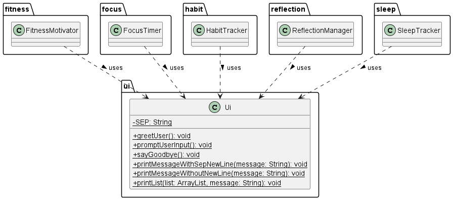
- `Ui` class
  - Overview
    - This class is a collection of methods that standardise the printing of messages to the CLI.
  - Attributes:
    - `SEP`: A private static string constant that stores a separation line.
  - Methods:
    - `greetUser()`: A public static method that prints a welcome message when Wellness360 is started.
    - `promptUserInput()`: A public static method that prints a "You: " message before the input cursor, to signal the input of
    - `sayGoodbye()`: A public static method that prints a farewell message when Wellness360 is terminated by the user.
    - `printMessagewithSepNewLine(String message)`: A public static method used to print a message with a separation line.
    - `printMessageWithoutNewLine(String message)`: A public static method used to print a message without a separation line.
    - `printList(ArrayList list, String message)`: A public static method to print a list of type `ArrayList`, along with a message and a separation line.
### Command parser component

### Storage component
#### Description
The Storage component deals with the storage of all the data collected from the other components in the hard disk 
in the form of text files so that data can be loaded from the hard disk when Wellness360 starts up.

#### Design Considerations
* ##### User Design Considerations
  * File path for storage of data should all be in the folder /data for ease of locating the storage files
  * Storage data can be easily read with the use of comma separated values

* #### Developer Design Considerations
  * SRP: Classes adhere to the Single Responsibility Principle. For example, Storage class is specifically for creating/
  writing/reading of files, while HabitTrackerStorage/SleepTrackerStorage deals with the processing of data for storage 
  and reading for their individual components
  * Readability and Maintainability: Ensure there are no magic numbers used. For example, use of constants for 
  information position in the text file.
  * Exception Handling: Graceful error handling with meaningful messages.

#### Implementation

##### Class Diagram
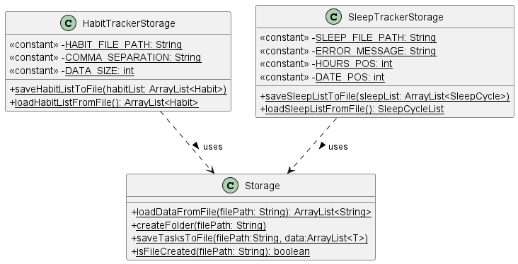

* `Storage` class:
  * Overview
    * The `Storage` class is in charge of saving/loading of data.
  * Methods
    * `loadDataFromFile(String filepath)`: Stores lines in text file into an array of Strings.
    * `createFolder(String filepath)`: Creates text file and folder to store file in.
    * `saveTasksToFile(String filepath, ArrayList<T> data)`: Write data into text file
    * `isFileCreated(String filepath)`: Checks if file has been created

* `HabitTrackerStorage` class:
  * Overview
    * The `HabitTrackerStorage` class converts data into comma separated values and stores it in a text file.
  * Attributes
    * `HABIT_FILE_PATH`: File path for storage of habit list
    * `COMMA_SEPARATION`: Separator to be placed between each data value
    * `DATA_SIZE`: Number of values in a data point (Habit)
  * Methods
    * `saveHabitListToFile(ArrayList<Habit> habitList)`: Saves habit list into a text file.
    * `loadHabitListFromFile()`: Loads habit list from a text file.
  * Dependencies
    * Storage: reading/writing/creating files
  * UML Notes:
    * It relies on `Storage` class for reading and writing of files

* `SleepTrackerStorage`
    * Overview
        * The `SleepTrackerStorage` class converts data into comma separated values and stores it in a text file.
    * Attributes
      * `SLEEP_FILE_PATH`: File path for storage of sleep cycles
      * `ERROR_MESSAGE`: Message to be print when file is corrupted
      * `HOURS_POS`: position of hours parameter in comma separated values
      * `DATE_POS`: position of date parameter in comma separated valuees
    * Methods
        * `saveSleepListToFile(ArrayList<SleepCycle> sleepList)`: Saves sleep list into a text file.
        * `loadSleepListFromFile()`: Loads sleep list from a text file.
    * Dependencies
        * Storage: reading/writing/creating files
    * UML Notes:
        * It relies on `Storage` class for reading and writing of files


##### Sequence Diagram 

##### Loading Data Sequence Diagram
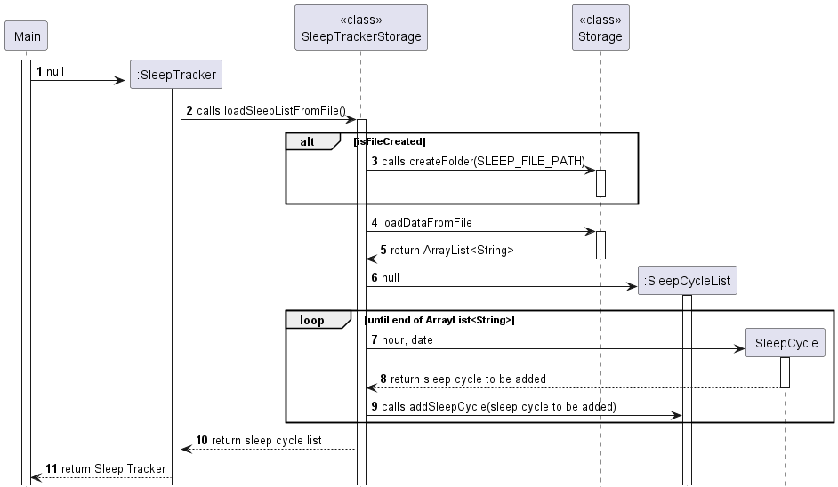

* Note: HabitTrackerStorage works in a similar way as SleepTrackerStorage

When `Main` starts, `SleepTracker` object is created. `SleepTrackerStorage loadSleepListFromFile()` method is called to 
Begin loading sleep cycles from text file. `SleepCycleList` is returned to `SleepTracker` class and Sleep Tracker class 
is successfully instantiated.

##### Saving Data Sequence Diagram
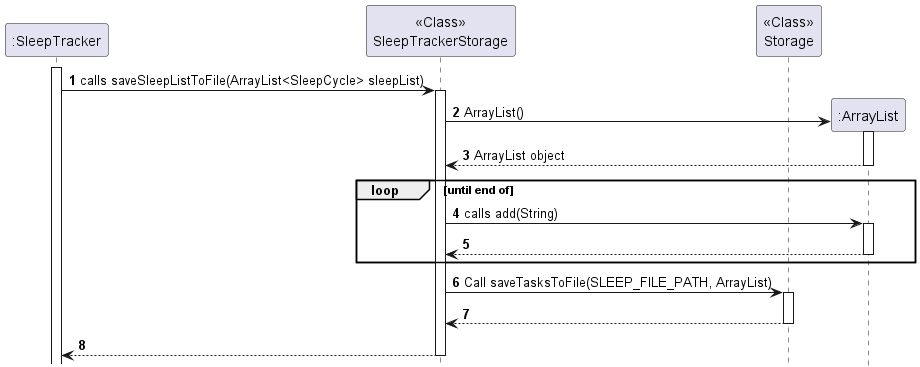

* Note: HabitTrackerStorage works in a similar way as SleepTrackerStorage

When `SleepTracker` executes `saveSleepListToFile` method from `SleepTrackerStorage` class, `ArrayList<String>` is 
created and after successfully converting sleepCycleList to String format, SleepTrackerStorage then calls 
`saveTasksToFile` from `Storage` class to write data into text file.

### Reflection component
#### Description
The Reflection component provides users with random reflections questions to reflect on about their personal lives and goals. 
This component aims to contribute to the goal of improving user's wellness.

#### Design Considerations
* ##### User Design Considerations
  * The sets of 5 questions are randomly generated each time. They are randomised to allow users to reflect on different areas. 
  * Users can save questions they liked into their favourites list for future review.
  * Users can also delete questions from their favourites list if the question is no longer relevant to them.
  * Help menu is available for new users to guide them on how to use the reflection feature.
  * Error messages with guidance messages will be printed to console if command input by user is invalid.


* #### Developer Design Considerations
  * Modularity: Organized into packages for separation of concerns. Each package contains related classes, such as ReflectionManager and ReflectionList in the reflection package, and ReflectionCommandParser in the parser package.
  * Abstraction: Use of abstract classes and interfaces for flexibility and extensibility. Abstract classes (ReflectionList) provide a common structure and behavior for subclasses (FavoriteReflectionsList, ReflectionQuestionBank), promoting code reuse and ensuring consistent functionality across different implementations.
  * Encapsulation: Private access modifiers and encapsulated methods ensure data integrity. Methods like addReflectionQuestion() and removeReflectionQuestion() in ReflectionList encapsulate the manipulation of the reflection list, ensuring data integrity and promoting a clear interface for interacting with the list.
  * Exception Handling: Graceful error handling with meaningful messages.
  * Command Design Pattern: Encapsulation of actions as objects for decoupling.
  * Dependency Injection: Dependencies injected via constructors for loose coupling.
  * SRP: Classes adhere to the Single Responsibility Principle. For example, the ReflectionManager class is responsible for managing reflection-related operations, while the ReflectionCommandParser class handles parsing and determining reflection commands.
  * Readability and Maintainability: Descriptive naming, comments, and documentation for clarity.

#### Implementation

##### Class Diagram
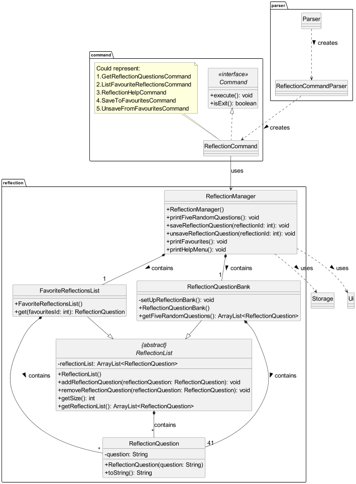

Note that certain details described below have been omitted from Class Diagram for simplicity and to improve readability.
  * `ReflectionManager` class
    * Overview
      * The `ReflectionManager` class oversees reflection-related operations, managing reflection questions and favorites. 
    * Attributes:
      * `HELP_MENU_INSTRUCTIONS`: Array containing instructions for the help menu. 
      * `FAVOURITE_QUESTIONS_FILE_PATH`: Path to the file storing favorite reflection questions. 
      * `fiveRandomQuestions`: ArrayList holding five random reflection questions. 
      * `questionBank`: Instance of `ReflectionQuestionBank` managing reflection questions.
      * `favoriteReflectionsList`: Instance of `FavoriteReflectionsList` managing favorite reflection questions.
    * Methods:
      * `printFiveRandomQuestions()`: Prints five random reflection questions.
      * `saveReflectionQuestion(int reflectionId)`: Saves a reflection question to favorites based on ID.
      * `unsaveReflectionQuestion(int reflectionId)`: Removes a reflection question from favorites based on ID.
      * `printFavourites()`: Prints the list of favorite reflection questions.
      * `printHelpMenu()`: Prints the help menu with available reflection commands.
    * Dependencies:
      * Storage: Utilized for data storage operations.
      * Ui: Utilized for user interface interactions.
    * UML notes:
      * `ReflectionManager` contains exactly one `ReflectionQuestionBank` class and one `FavoriteReflectionsList` class.
      * It relies on `Storage` class for file operations and `Ui` class for user interactions.
  
  * `ReflectionQuestion` class
    * Overview:
      * This class represents a reflection question
    * Attributes:
      * `question`: Private attribute holding the text of the reflection question.
    * Methods:
      * `toString()`: Overriden method that retrieves the text of the reflection question.
    * UML notes:
      * `ReflectionList` and `FavoriteReflectionsList` may contain 0 or more `ReflectionQuestion` instances.
      * `ReflectionQuestionBank` contains exactly 41 of `ReflectionQuestion` instances.
      * When a `ReflectionList`/ `FavoriteReflectionsList`/ `ReflectionQuestionBank` object is destroyed, its associated `ReflectionQuestion` instances are also destroyed, reflecting a "whole-part" relationship.
  
  * `ReflectionList` class
    * Overview:
      * The `ReflectionList` class serves as an abstract representation of a list of reflection questions within the Reflection Management System. It provides basic operations for managing reflection questions, such as adding, removing, and retrieving questions from the list.
    * Attributes:
      * `reflectionList`: Protected attribute representing the list of reflection questions. It is an ArrayList of `ReflectionQuestion` objects.
    * Methods:
      * `addReflectionQuestion(ReflectionQuestion reflectionQuestion)`: Adds a reflection question to the list. 
      * `removeReflectionQuestion(ReflectionQuestion reflectionQuestion)`: Removes a reflection question from the list.
      * `getSize()`: Retrieves the size of the reflection list. 
      * `getReflectionList()`: Retrieves the list of reflection questions.
    * UML notes:
      * `FavoriteReflectionsList` inherits from `ReflectionList`
      * `ReflectionQuestionBank` inherits from `ReflectionList`
      * `ReflectionList` may contain 0 or more instances of `ReflectionQuestion`. The association is of type composition.
  
  * `FavoriteReflectionsList` class
    * Overview:
      * The `FavoriteReflectionsList` class extends the `ReflectionList` class and represents a specialized list of favorite reflection questions within the Reflection Management System. It inherits functionality from `ReflectionList`.
    * Attributes:
      * Inherits from the superclass `ReflectionList`.
    * Methods:
      * `get(int favouritesId)`: Retrieves a favorite reflection question by its index in the list.
    * Dependencies:
      * Inherits functionality from the `ReflectionList` class.
    * UML notes:
      * `FavoriteReflectionsList` inherits from `ReflectionList`.
      * `ReflectionManager` contains a single instance of `FavoriteReflectionsList`.
      * `FavoriteReflectionsList` may contain 0 or more instances of `ReflectionQuestion`.

  * `ReflectionQuestionBank` class
    * Overview:
      * The `ReflectionQuestionBank` class represents a bank of reflection questions within the Reflection Management System. It extends the ReflectionList class to inherit basic list management functionalities and provides additional methods for initializing the bank with predefined questions and retrieving random sets of questions.
    * Attributes:
      * Inherits from the superclass `ReflectionList`. 
      * `REFLECTION_QUESTIONS`: Static array containing predefined reflection questions that used for setup of question bank.
    * Methods:
      * `setUpReflectionBank()`: Initializes the reflection question bank with predefined questions. 
      * `getFiveRandomQuestions()`: Retrieves five random reflection questions from the bank.
    * Dependencies:
      * Inherits functionality from the `ReflectionList` class.
    * UML notes:
      * `ReflectionManager` contains a single instance of `ReflectionQuestionBank`
      * `ReflectionQuestionBank` inherits from `ReflectionList`
      * `ReflectionQuestionBank` contains 41 instances of `ReflectionQuestion`
  
  * `ReflectionCommandParser`
    * Overview: Parses reflection-related commands and create different reflection command objects based on user input.
    * Method: `determineReflectionCommand(ReflectionManager reflectionManager, String commandArgs)`
  
  * Reflection command classes
    * `GetReflectionQuestionsCommand`: Retrieve random reflection questions.
      * Command format: `reflect get`
    * `ListFavouriteReflectionsCommand`: List favorite reflection items.
      * Command format: `reflect list`
    * `ReflectionHelpCommand`: Display help menu for reflection commands.
      * Command format: `reflect help`
    * `SaveToFavouritesCommand`: Save a reflection item to favorites.
      * Command format: `reflect save <reflection_id>`
    * `UnsaveFromFavouritesCommand`: Unsave a reflection item from favorites.
      * Command format:`reflect unsave <reflection_id>`


#### Sequence Diagram
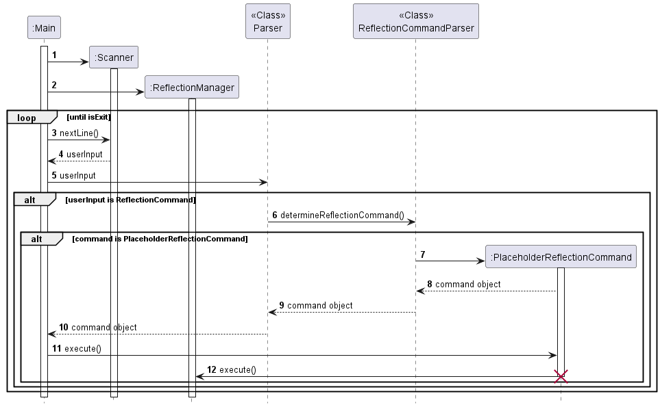
* Note that `PlaceholderReflectionCommand` can refer to any of the reflection commands as mentioned above, as all of them follow the same call pattern.

When `Main` starts, `scanner` and `ReflectionManager` objects are created. Upon receiving user input, the input will first be
determined if it is a command related to the reflection feature. If it is, it will be further parsed by `ReflectionCommandParser` to determine
the command. The corresponding reflection command object is then created and is returned to `Main`, where `execute` will then be called
and the corresponding method in `ReflectionManager` is invoked.

### Habit tracker component

#### Description
The habit tracker component aims to provide user with a tool to track and cultivate good habits.

#### Design Considerations
* ##### User Design Considerations
    * User can add new habits in the habit tracker that they wish to cultivate.
    * User can increase the count of a habit after they completed the habit for the day, allowing them to keep track of the total number of times they completed the habit.
    * User can also delete the habit if they no longer want to cultivate that habit.
    * User are able to set the priority of the habits (HIGH, MED, LOW), to prioritise their time on more important habits.
    * User can also sort the habits according to their priority for better visualization.
    * A help menu is also provided for users to guide them on how to use the habit tracker.
    * Error messages with guidance messages will be printed to console if command input by user is invalid.

* #### Developer Design Considerations
    * Modularity: Encapsulate related functionalities within classes to promote re-usability and maintainability.
    * Exception Handling: Use of custom exceptions to differentiate between various types of errors, and to handle them appropriately with error messages
    * Data Encapsulation: Control the access to a class's internal attributes, accessible only through getters and setters
    * Interface Segregation: Segregation of command interface to represent different command types for specific use cases.
    * Readability and Maintainability: Descriptive naming, robust documentation for code clarity.

#### Implementation

##### Class Diagram
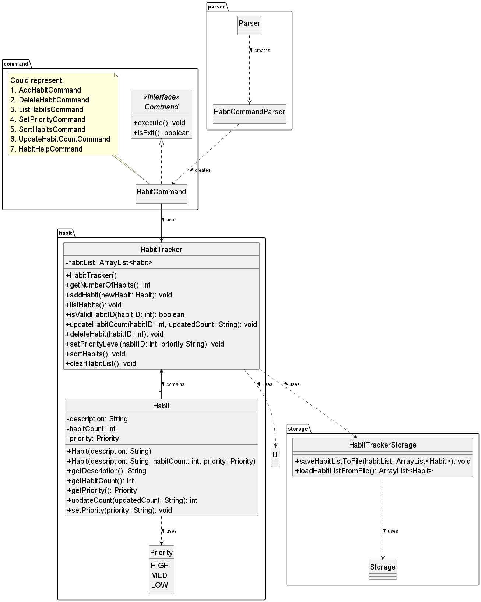

* `HabitTracker` class
    * Overview
        * The `HabitTracker` class manages the habit tracker list which contains the habits.
    * Attributes:
        * `habitList`: Private attribute representing the list of habits. It is an ArrayList of Habit objects.
    * Methods:
        * `HabitTracker()`: Constructs a HabitTracker object. 
        * `getNumberOfHabits()`: Returns the number of habits in the habitList.
        * `addHabit(Habit newHabit)`: Adds a new Habit object into the habitList.
        * `listHabits()`: Prints a list of all habits in habitList .
        * `isValidHabitID(int habitID)`: Check if a habit ID is valid by comparing with the size of habitList.
        * `updateHabitCount(int habitID, String updatedCount)`: Update the habit count of a habit.
        * `deleteHabit(int habitID)`: Delete a habit from habitList.
        * `setPriorityLevel(int habitID, String priority)`: Set the priority of a habit.
        * `sortHabits()`: Sort the habits in habitList according to the habits' priorities.
        * `clearHabitList()`: Delete all habits from habitList.
    * Dependencies:
        * HabitTrackerStorage: Utilized for data storage operations.
        * Ui: Utilized for user interface interactions.
    * UML notes:
        * `HabitTracker` can contain any number of `Habit` class objects.
        * It relies on `HabitTrackerStorage` class for file operations and `Ui` class for user interactions.

* `Habit` class
    * Overview:
        * This class represents a Habit.
    * Attributes:
        * `description`: Private attribute holding the habit description.
        * `habitCount`: Private attribute holding the total count the user have completed the habit.
        * `priority`: Private attribute representing the priority level of a habit.
    * Methods:
        * `Habit(String description)`: Constructs a habit object.
        * `Habit(String description, int habitCount, Priority priority)`: Constructs a habit object.
        * `getDescription()`: Get the description of the habit.
        * `getHabitCount()`: Get the habit count of the habit.
        * `getPriority()`: Get the priority of the habit.
        * `toString()`: Method that formats the attributes of the habit for printing.
    * UML notes:
        * `HabitTracker` can contain any number of `Habit` instances.
        * When a `HabitTracker` object is destroyed, its associated `Habit` instances are also destroyed, showcasing a composition relationship.

* `HabitCommandParser`
    * Overview: Parses habit-tracker commands and create different habit command objects based on user input.
    * Method: `determineHabitCommand(HabitTracker habitTracker, String commandArgs)`

* Habit command classes
    * `AddHabitCommand`: Add a new habit to the habit-tracker.
        * Command format: `habit add <habit_description>`
    * `DeleteHabitCommand`: Delete a habit from the habit-tracker.
        * Command format: `habit delete /id <habit_ID>`
    * `ListHabitsCommand`: Prints a list of all existing habits.
        * Command format: `habit list`
    * `UpdateHabitCountCommand`: Increase habit count after completing a habit.
        * Command format: `habit update /id <habit_ID> /by <increment_count>`
    * `SetPriorityCommand`: Set priority level of habit
        * Command format: `habit set /id <habit_ID> /priority <priority_level>`
    * `SortHabitsCommand`: Sort habit list according to priority level.
        * Command format: `habit sort`
    * `HabitHelpCommand`: Display a help menu of the habit-tracker commands
        * Command format: `habit help`


#### Sequence Diagram
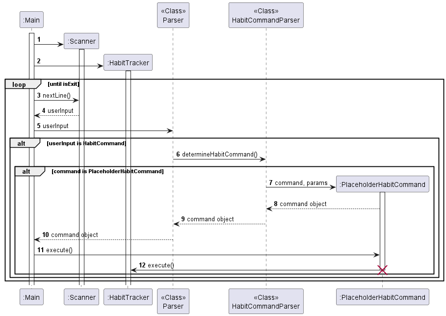
* Note that `PlaceholderHabitCommand` can refer to any of the habit commands. 

When `Main` starts, `scanner` and `HabitTracker` objects are created. Upon receiving user input, the input will first be
determined if it is a command related to the habit tracker feature. If it is, it will be further parsed by `HabitCommandParser` to determine
the command. The corresponding habit command object is then created and is returned to `Main`, where `execute` will then be called
and the corresponding method in `HabitTracker` is invoked.

### Sleep tracker component

#### Description

The Sleep tracker component allow users to keep track of the number of hours they have slept, so that users will know
when their lacking sleep or getting more sleep hours as the day progresses. With information on the user's sleep cycle,
one will be able to understand what is their optimal sleep cycle. With this users can have better sleep, improving
user's wellness.

#### Design Considerations

* ##### User Design Considerations
    * Users can add hours slept on a specific date
    * Users can update hours slept on a specific date in case of mistakes in adding of sleep hours
    * Users can list out all sleep hours tracked or get number of hours slept on a specific date
    * Users can delete sleep cycles with deletion methods of:
        * Deleting a sleep cycle that is of a certain date
        * Deleting sleep cycles before a certain date
        * Deleting sleep cycles between certain dates
    * Error messages with guidance messages will be printed to console if command input by user is invalid.


* ##### Developer Design Considerations
    * SRP: Ease of scalability is achieved as classes adhere to the Single Responsibility Principle. For example, 
    the SleepTracker class is responsible for managing sleep tracker related commands, SleepCommandParser class handles
    parsing and determining which sleep command is being called and SleepCycleList is responsible for storing sleep 
    cycles and methods that can be called to edit it's content.
    * Readability and Maintainability: Descriptive naming, use of Enumerations and JavaDoc for clarity. 
    For example, use of enumerations for deleteMode.
    * Encapsulation: Private access modifiers and encapsulated methods ensure data integrity. Methods like addSleepCycle
    and deleteSleepCycle in SleepCycleList encapsulate the manipulation of the reflection list, ensuring data integrity
    and promoting a clear interface for interacting with the list.
    * Exception Handling: Extensive coverage of exceptions in sleepCommand classes to ensure all errors are handled 
    properly

#### Implementation

##### Class Diagram
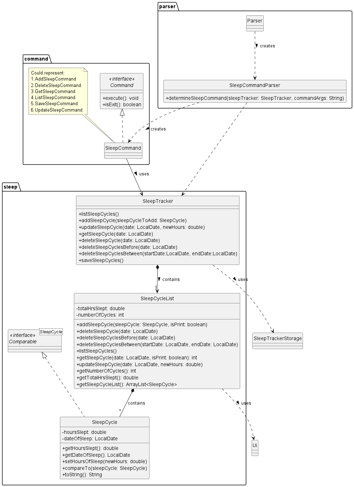

* `SleepTracker` class
  * Overview
    * The `SleepTracker` class oversees sleep-related operations, managing sleep cycles.
  * Attributes:
    * `sleepCycleList`: Instance of `SleepCycleList` managing sleep cycles.
  * Methods:
    * `listSleepCycles()`: List out all sleep cycles.
    * `addSleepCycle(SleepCycle sleepCycleToAdd)`: Add sleep cycle.
    * `updateSleepCycle(LocalDate date, double newHours)`: Change hours slept for specific date.
    * `getSleepCycle(LocalDate date)`: Get number of hours slept for specific date.
    * `deleteSleepCycle(LocalDate date)`: Delete sleep cycle for specific date.
    * `deleteSleepCyclesBefore(LocalDate date)`: Delete sleep cycle before specific date.
    * `deleteSleepCyclesBetween(LocalDate startDate, LocalDate endDate)`: Delete sleep cycles between 2 dates.
    * `saveSleepCycles()`: Save sleep cycle list into a text file.
  * Dependencies:
    * `SleepTrackerStorage`: Utilized for sleep cycle data storage operations
  * UML Notes:
    * `SleepTracker` contains only 1 `SleepCycleList`
    * It relies on `SleepTrackerStorage` class for file operations

* `SleepCycle` class
  * Overview:
    * This class represents a sleep cycle
  * Attributes:
    * `hoursSlept`: Number of hours slept
    * `dateOfSleep`: Date that user slept on
  * Methods:
    * getHoursSlept(): Get Hours slept for this sleep cycle.
    * getDateOfSleep(): Get date slept for this sleep cycle.
    * setHoursOfSleep(double newHours): Set Hours slept for this sleep cycle to a new duration.
    * compareTo(SleepCycle: SleepCycle): Comparison between sleep cycles.
    * toString(): String format for what needs to be printed out for a sleep cycle.
  * `SleepCycleList` may contain 0 or more instances of `SleepCycle`.
  * UML Notes:
    * When a `SleepCycleList` object is destroyed, its associated `SleepCycle` instances are also destroyed,
    reflecting a "whole part" relationship.

* `SleepCycleList` class
  * Overview
    * The `SleepCycleList` class contains all sleep cycles added by the user.
  * Attributes:
    * `totalHrsSlept`: Accumulated number of hours slept from all sleep cycles. 
    * `numberOfCycles`: Number of sleep cycles in sleepCycleList.
  * Methods:
    * `listSleepCycles()`: List out all sleep cycles.
    * `addSleepCycle(SleepCycle sleepCycleToAdd)`: Add sleep cycle.
    * `updateSleepCycle(LocalDate date, double newHours)`: Change hours slept for specific date.
    * `getSleepCycle(LocalDate date)`: Get number of hours slept for specific date.
    * `deleteSleepCycle(LocalDate date)`: Delete sleep cycle for specific date.
    * `deleteSleepCyclesBefore(LocalDate date)`: Delete sleep cycle before specific date.
    * `deleteSleepCyclesBetween(LocalDate startDate, LocalDate endDate)`: Delete sleep cycles between 2 dates.
    * `getNumberOfCycles()`: Get number of sleep cycles in sleepCycleList.
    * `getTotalHrsSlept()`: Get total number of hours slept.
    * `getSleepCycleList`: Get list of sleep cycles.
  * Dependencies:
    * Ui: Utilized for user interface interactions
  * UML Notes:
    * `SleepTracker` contains a single instance of `SleepCycleList`.
    * `SleepCycleList` may contain 0 or more instances of `SleepCycle`. 
    * It relies on `Ui` class for user interaction.

* `SleepCommandParser` class
  * Overview: 
    * Parses sleep-related commands and create different sleep command objects based on user input.
  * Method:
    * determineSleepCommand(SleepTracker sleepTracker, String commandArgs)

* Sleep command classes
    * `AddSleep Command`: Add a sleep cycle.
        * Command format: `sleep add`
    * `DeleteSleepCommand`: Delete sleep cycles.
        * Delete sleep cycle matching date command format: `sleep delete /date <date>`
        * Delete sleep cycle before date command format: `sleep delete /before <date>`
        * Delete sleep cycles between 2 dates command format: `sleep delete /from <start_date /to <end_date>`
    * `GetSleepCommand`: Get number of hours slept on a specific date.
        * Command format: `sleep get <date>`
    * `ListSleepcommand`: Get information on all the sleep.
        * Command format: `sleep list`
    * `SaveSleepCommand`: Save current sleep cycles added/deleted/updated into a text file.
        * Command format:`sleep save`
    * `UpdateSleepCommand`: Change number of hours slept on a specific date.
        * Command format: `sleep update <date> /new <new_hours>`
    
##### Sequence Diagram

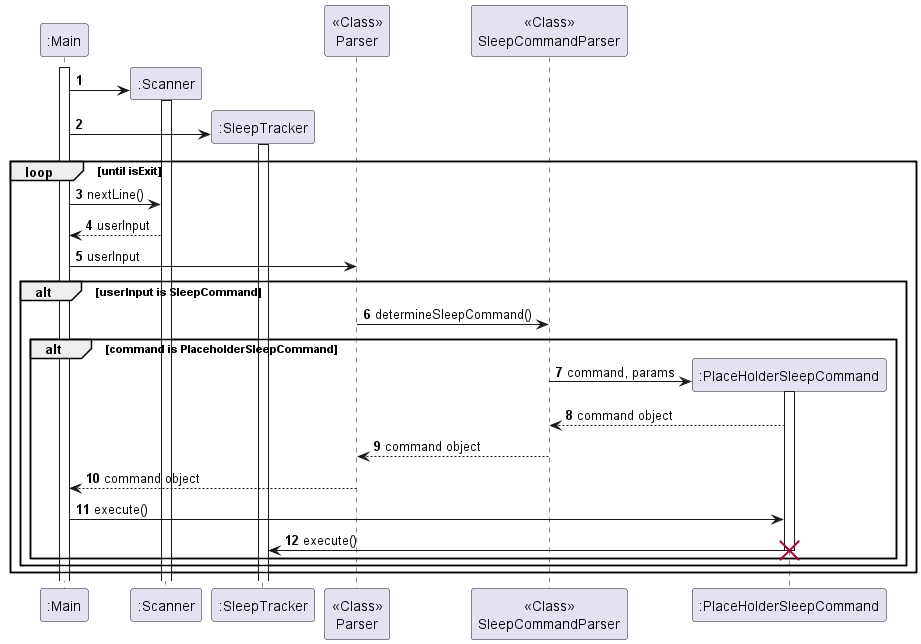

* Note that PlaceholderReflectionCommand can refer to any of the reflection commands as mentioned above, 
as all of them follow the same call pattern.

When main starts, scanner and SleepTracker objects are created. Upon receiving user input, the input will first 
be determined if it is a command related to the sleep tracker feature. If it is, it will be further parsed by 
SleepTrackerParser to determine the command. The corresponding sleep command object is then created and is 
returned to Main, where execute will then be called and the corresponding method in SleepTracker is invoked.

### Focus timer component
The focus timer component provides users with a countdown timer and a count up timer, which enables the user to set a 
goal to focus entirely on their work. This component aims to allow users to keep track of their time, improving their
productivity and well-being.

### Design Considerations
* #### User Design Considerations
  * Users will be able to choose between a count up timer and a countdown timer.
  * Users can start, pause, resume, stop the timer at any point in time.
  * Users will also be able to navigate to other functions while running the timer concurrently.
  * Error messages will inform users the current status of the timer and reason the error appeared.

* #### Developer Design Considerations
  * The `Focus Timer` component is a wrapper class for both `CountupTimer` and `CountdownTimer`, which contains 
utility logic to identify state and manage the different timers.

#### Implementation

#### Focus Class Diagram
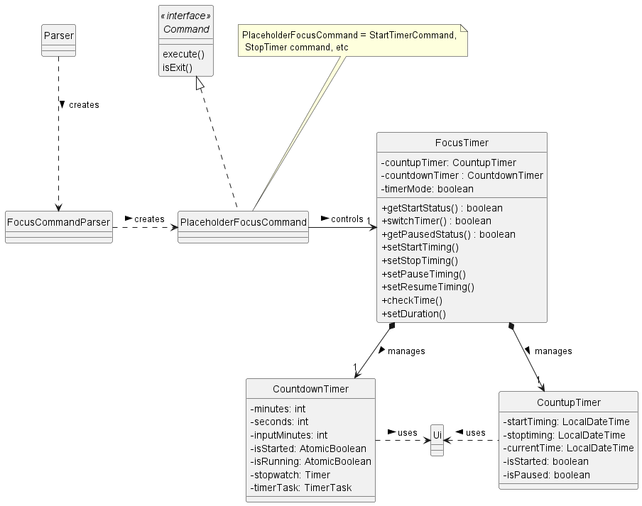
* `FocusTimer` object
  * Overview:
    * The `FocusTimer` class is a facade class that sits between the component internals and users of the component 
    such that all access to the component like countdown timer and count up timer happens through the Facade class.
  * Attributes:
    * `countupTimer`: Count up timer object.
    * `countdownTimer`: Count down timer object.
    * `timerMode`: Indicates the timer mode to be operating.
  * Methods:
    * `getStartTiming()`: Gets the current running state of the timer.
    * `switchTimer()`: Changes the timer mode between count up and count down timer.
    * `getPausedStatus()`: Gets the current pause status of the timer.
    * `setStartTiming()`: Start the timer.
    * `setStopTiming()`: Stop the timer.
    * `setPauseTiming()`: Pause the timer.
    * `setResumeTiming()`: Resume the timer.
    * `checkTime`: Get the total time elapsed or time remaining in the timer.
    * `setDuration`: Change countdown timer duration.
    
* `CountupTimer` and `CountdownTimer` object
  * Dependencies:
    * `Ui` object: Utilized for user interface interactions.

#### Focus State transition Diagram
There are many commands for the focus timer feature. However, some commands logically cannot be executed in cetain 
states. For example, the command `focus pause` cannot be used if the timer hasn't started. Another example would be 
the `focus switch` command to switch between the timer could not be used if the current timer mode is running. To aid 
the understanding of the logic, we will use state transition diagram.

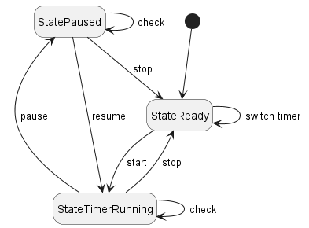
* The black circle in the diagram represents the starting point of focus timer. 
* The labels of the arrows represents the commands.

#### Focus Sequence Diagram
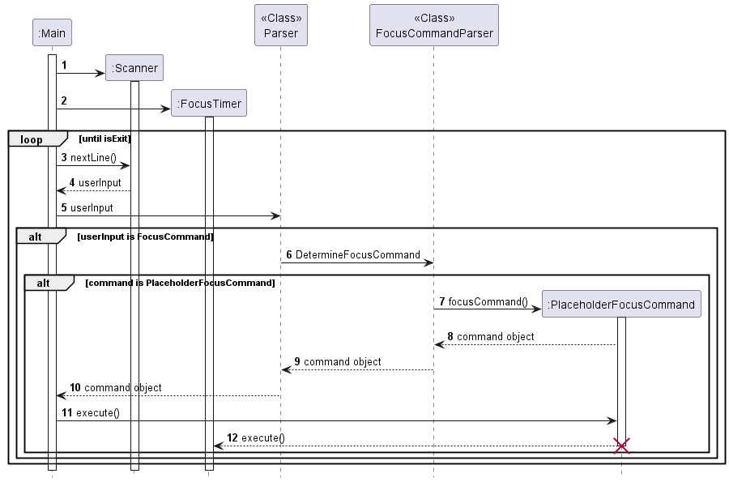
* Note that `PlaceholderFocusCommand` can refer to any of the focus commands as mentioned above, since all of them 
follows the same call pattern.

When `Main` starts, `scanner` and `FocusTimer` objects are created. Upon receiving user input, the input will first be
determined if it is a command related to the focus timer feature. 
If it is, it will be further parsed by `FocusCommandParser` to determine the command. 
The corresponding focus command object is then created and is returned to `Main`, where `execute` will then be called 
and the corresponding method in `FocusTimer` is invoked.


### Fitness Motivator component
#### Description
The Fitness Motivator provides users with a list of exercises, and give these users the ability to add and track their
fitness goals. This component aims to contribute to the goal of improving the user's wellness, mainly their physical
well-being.

#### Design Considerations

- #### User Design Considerations
    - Users are able to generate a list of 5 different exercises that target 5 different parts of the body: The arms, chest, abs, back and legs. The list is randomly generated each time, to allow for the mixing of exercises.
    - Users can also choose to generate exercises that generate a single part of the body, should they choose to target that part of the body for exercise.
    - Users are given the freedom of adding, editing and deleting exercises to the list, to increase the number of different exercises that can be done.
    - What good are exercises if there is no way of keeping track of progress? The goal tracker does this by generating 5 exercises for the user to do that day. It then allows the user to mark the exercise as done or not done, along with a progress bar for the user to track their progress.
    - Error messages helps guide the user with usage of the fitness tracker, to ensure ease of usage.
- #### Developer Design Considerations
    - _Modularity_: All related classes are grouped together into packages. Command parsers are placed in the parser package, with individual command execution further placed into the fitnesscommands package. The execution of fitness logic are all grouped into the fitness package.
    - _Abstraction_: The command interface is used to specify methods to be implemented in every single exercise command, creating a pre-written template and behaviour for all command classes.
    - _Encapsulation_: The usage of private attributes and the use of helper methods help ensure data integrity. Get methods in the Exercise class and ExerciseList class ensure that the data is manipulated in the way that was intended by the developer and thus protecting the data.
    - _Inheritance_: Commands with similar classes utilise inheritance to reduce code repetition of similar methods.
    - _Exception Handling_: Exception Handling prevents the code from reaching an unknown or unpredictable state, which could break the program.
    - _Design Pattern_: To Be Continued
    - _Code Readability_: Proper coding convention, Java Docs and comments were added for clarity so that other developers can more easily review our code.
<!-- Modularity, Inheritance, Encapsulation, Exception Handling, Design Pattern, readability, etc --> 

#### Implementation
#### Class Diagram
<!-- Insert image and description of each class, with its overview, attributes,
methods, dependencies and UML Notes -->
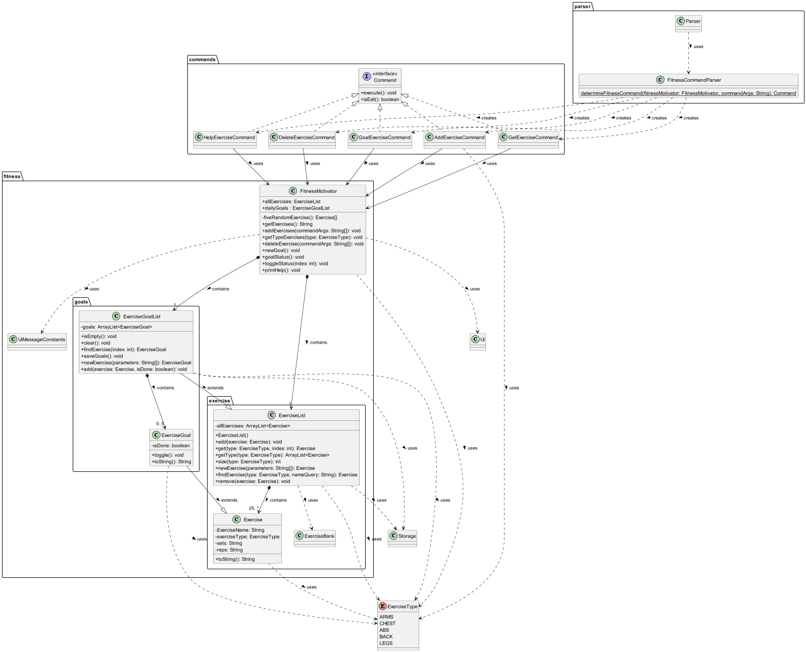
Note that certain details described below have been omitted from Class Diagram for simplicity and to improve readability.
- `FitnessMotivator` Class
  - Overview
    - The `FitnessMotivator` class manages fitness related operations.
  - Attributes:
    - `DATA_FILE_PATH`: A string that represents the path to the save file for the fitness motivator 
    - `GOALS_FILE_PATH`: A string that represents the path to the save file for the fitness motivator 
    - `REQUIRED_NUM_OF_PARAMETERS`: The number of parameters needed for the `add` command. 
    - `allExercise`: An instance of `ExerciseList`.
    - `dailyGoals`: An instance of `ExerciseGoalList`.
  - Methods:
    - `fiveRandomExercises()`: Generates five random integers within the index of each `ExerciseType`, then returns an array of exercises, where each exercise belongs to a different `ExerciseType`.
    - `getExercises()`: Uses `fiveRandomExercises()`, then prints the exercises generated.
    - `getTypeExercises(ExerciseType type)`: Prints all the exercises belonging to the queried `ExerciseType`.
    - `addExercises(String[] commandArgs)`: Add the user-specified exercise into `allExercises`.
    - `deleteExercises(String[] commandArgs)`: Delete the user-specified exercise by using its `ExerciseType` and index to remove it from the list.
    - `newGoals()`: Uses `fiveRandomExercises()`, then converts them to `ExerciseGoal` objects and adds them to the dailyGoals list.
    - `goalStatus()`: If the list of goals is not empty, it prints out all the currently set `ExerciseGoal` and its status, otherwise it shows a message that says there are no goals.
    - `toggleGoal(int index)`: Toggles the status of the user-specified `ExerciseGoal` based on its index.
    - `printHelp()`: Prints out a list of commands and briefly describes what each command does.
  - Dependencies:
    - Ui: Utilised for user interface interactions.
    - Enum ExerciseType: Utilised to allow only specified types of exercises.
    - UiMessageConstants: A class with static string constants, where each string stores a different message for printing.
  - UML Notes:
    - `FitnessMotivator` class only contains one `ExerciseList`, and one `ExerciseGoalList`.
- `ExerciseList` Class
  - Overview:
    - The `ExerciseList` class directly manipulates the list of `Exercises`, and provides methods to do so.
  - Attributes:
    - `allExercises`: A private instance of an `ArrayList` of `Exercises`.
  - Methods:
    - `ExerciseList()`: A public constructor method, it checks if a local save file exists. If it does not, it creates a new file and initialises it with data, otherwise it will simply load the file.
    - `initialiseSingleList(String[] list, ExerciseType type)`: A private helper method used to read an array of strings and convert it into exercises to be added into the list. 
    - `initialiseData()`: A private helper method used to initialise all 5 list by calling `initialiseSingleList` five times. 
    - `parseData(ArrayList<String> data)`: A private helper method used to further process the `ArrayList` of strings read by the Storage class. 
    - `add(Exercise exercise)`: A public helper method used to add an `Exercise` object into `allExercises`.
    - `get(ExerciseType type, int index)`: A public helper method used to query for an `Exercise` Object that matches the n-th `Exercise` with the matching `ExerciseType`, where n = index.
    - `getType(ExerciseType type)`: A public helper method used to query for all of the `Exercise` objects that match the `ExerciseType`.
    - `size(ExerciseType type)`: A public helper method that returns the total number of `Exercise` objects that match the `ExerciseType`.
    - `newExercise(String[] parameters)`: A public helper method that creates an `Exercise` Object from an array of strings.
    - `findExercise(ExerciseType type, String nameQuery)`: A public helper method that searches for an `Exercise` object within `allExercises` using `ExerciseType` and a string which represents the name being searched.
    - `remove(Exercise exercise)`: A public helper method that removes a specified `Exercise` Object from `ExerciseList`.
  - Dependencies:
      - Storage: Utilised for persistent memory storage.
      - Enum ExerciseType: Utilised to allow only specified types of exercises.
      - ExerciseBank: Utilised for storage of initialisation data.
  - UML Notes:
    - `ExerciseList` contains at least 25 instances of `Exercise`.
    - When `FitnessMotivator` is destroyed, the `ExerciseList` instance is destroyed, reflecting a "whole-part" relationship.
    - `ExerciseList` is a parent class to `ExerciseGoalList`.
- `Exercise` Class
  - Overview:
    - The `Exercise` class stores the basic data of each exercise, such as its name, its type and the number of sets and reps to do.
  - Attributes:
    - `exerciseName`: A private string storing the name of the exercise.
    - `exerciseType`: A private `ExerciseType` object storing one of five types of exercises.
    - `sets`: A private string storing the number of sets to be done.
    - `reps`: A private string storing the number of reps to be done.
  - Methods:
    - `getType()`: A public helper method to obtain the `ExerciseType` of the exercise. 
    - `getExerciseName()`: A public helper method to obtain the name of the exercise. 
    - `getSets()`: A public helper method to get the number of sets to be done per exercise. 
    - `getReps()`: A public helper method to get the number of reps to be done per exercise. 
    - `toString()`: An overriden public method used to specify the string format of the `Exercise` object.
  - Dependencies:
    - Enum ExerciseType: Utilised to allow only specified types of exercises.
  - UML Notes:
    - `ExerciseList` contains at least 25 instances of `Exercise`.
    - When `ExerciseList` or `FitnessMotivator` is destroyed, the `Exercise` instances are destroyed as well, reflecting a "whole-part" relationship.
    - `Exercise` is the parent class of `ExerciseGoal`.
- `ExerciseBank` Class
    - Overview: 
      - The `ExerciseBank` class stores a collection of static string constants for initialisation.
    - Attributes:
      - `INIT_ARM_EXERCISES` : A public static array of `String` storing arm exercises, along with the exercise name, sets and reps to be done. 
      - `INIT_CHEST_EXERCISES`: A public static array of `String` storing chest exercises, along with the exercise name, sets and reps to be done. 
      - `INIT_ABS_EXERCISES`: A public static array of `String` storing abs exercises, along with the exercise name, sets and reps to be done. 
      - `INIT_BACK_EXERCISES`: A public static array of `String` storing back exercises, along with the exercise name, sets and reps to be done. 
      - `INIT_LEGS_EXERCISES`: A public static array of `String` storing leg exercises, along with the exercise name, sets and reps to be done. 
    - UML Notes:
      - Used exclusively by `ExerciseList`.
- `ExerciseGoalList` Class
  - Overview: 
    - The `ExerciseGoalList` class inherits from the class `ExerciseList`, but storing `ExerciseGoal` objects instead of `Exercise` objects. It also implements additional methods.
  - Attributes:
    - `NUMBER_OF_GOALS`: A private static constant integer value representing the maximum number of goals in the `ExerciseGoalList`.
    - `goals`: A private `ArrayList` of `ExerciseGoal` objects.
  - Methods:
    - `parseData(ArrayList<String> data)`: A private helper method used to further process the `ArrayList` of strings read by the Storage class. In this class, the data is initialised into `ExerciseGoal` Objects instead of `Exercise` Objects. 
    - `isEmpty()`: A public helper method used to check if the `ExerciseGoalList` is empty.
    - `clear()`: A public helper method used to reset the `ExerciseGoalList` by deleting all `ExerciseGoal` objects within.
    - `findExercise(int index)`: A public helper method used to find an `ExerciseGoal` based on its index.
    - `saveGoals()`: A public helper method used to save the current list to a local storage.
    - `newExercise(String[] parameters)`: An overriden public method from the parent class, it is used to create a new `ExerciseGoal` object, with its `isDone` attribute initialised to `false`.
    - `add(Exercise exercise, boolean isDone)`: A public method overloaded from the parent class, it adds a pre-existing `Exercise`, converts it with a declared `isDone` parameter, before adding it into the list and saving locally.
    - `toString()`: An overriden public method used to specify the string format of the `ExerciseGoalList` object. 
  - Dependencies:
    - Storage: Utilised for persistent memory storage.
    - Enum ExerciseType: Utilised to allow only specified types of exercises.
  - UML Notes:
  - `ExerciseGoalList` is the child class of `ExerciseList`.
  - When `ExercisegoalList` or `FitnessMotivator` is destroyed, the `ExerciseGoal` instances are destroyed as well, reflecting a "whole-part" relationship.
  - `ExerciseGoalList` contains either 5 or 0 instances of `Exercise`.
- `ExerciseGoal` Class
  - Overview: 
    - The `ExerciseGoal` class inherits from the class `Exercise`, but adds an attribute to store the completion status of the exercise goal. 
  - Attributes:
    - All attributes of the `Exercise` class.
    - `isDone`: A private boolean storing the completion state of the `ExerciseGoal` object.
  - Methods:
    - `toggle()`: A public helper method used to toggle the state of the `ExerciseGoal` object.
    - `toString()`: An overriden public method used to specify the string format of the `ExerciseGoal` object.
  - Dependencies:
    - Enum ExerciseType: Utilised to allow only specified types of exercises.
  - UML Notes:
    - `ExerciseGoal` is the child class of `Exercise`.
    - `ExerciseGoalList` contains either 5 or 0 instances of `Exercise`.
    - When `ExercisegoalList` or `FitnessMotivator` is destroyed, the `ExerciseGoal` instances are destroyed as well, reflecting a "whole-part" relationship.
- `UiMessageConstants` Class
  - Overview:
    - The `UiMessageConstants` class stores all constant `String` variables used in the various printing methods in `FitnessMotivator`.
  - Attributes:
    - `NEW_GOAL_MESSAGE`: A public static `String` constant storing the new goal command message. 
    - `EMPTY_GOAL_MESSAGE`: A public static `String` constant storing the empty goal message. 
    - `GOAL_MESSAGE`: A public static `String` constant storing the goal command message. 
    - `GOAL_STATUS_MESSAGE`: A public static `String` constant storing the goal status message. 
    - `HELP_MESSAGE`: A public static `String` constant storing the help message. 
    - `ADD_EXERCISE_MESSAGE`: A public static `String` constant storing the add exercise message. 
    - `DELETE_EXERCISE_MESSAGE`: A public static `String` constant storing the delete exercise message. 
    - `HELP_MENU_INSTRUCTIONS`: A public static `String` constant storing all possible commands and a brief description of each command. 
  - UML Notes:
    - Used exclusively by `FitnessMotivator`.
- `ExerciseType` Enumeration
  - Overview:
    - The `ExerciseType` enumeration restricts the number of different types of exercises to five parts of the body, for easier sorting and management of all exercises.
  - Attributes:
    - `ARMS`: Exercises that work the Arms
    - `CHEST`: Exercises that work the Chest
    - `ABS`: Exercises that work the Abs
    - `BACK`: Exercises that work the Back
    - `LEGS`: Exercises that work the Legs
  - Methods:
    - `toString()`: An overriden public method used to specify the string format of the `ExerciseType` Enumeration. 
  - Dependencies:
    - Does not require any dependencies.
  - UML Notes:
    - It is used everywhere, as every feature in the FitnessMotivator uses/parses `Exercise` objects, which will always use `ExerciseGoal` objects.
- Fitness command classes
  - `GetExercisesCommand`:
    - Without parameters, the command retrieves 5 random exercises from each `ExerciseType` and prints it.
      - Command format: `fitness get`
    - With parameters, the command retrieves all the exercises from the specified `ExerciseType` and prints it.
      - Command format: `fitness get arms`
  - `AddExerciseCommand`: Add a user specified exercise into the list.
    - CommandFormat: `fitness add <ExerciseType>, <ExerciseName>, <Number_Of_Sets>, <Number_Of_Reps>`
  - `DeleteExerciseCommand`: Deletes a user specified `Exercise` from the list. 
    - CommandFormat: `fitness delete <ExerciseType> <Index>`
  - `GoalExerciseCommand`:
    - Without parameters, the command tries to retrieve the status of the list of `ExerciseGoal`.
      - Command format: `fitness goal`
    - With parameters, there are only 2 possible parameters.
      - This command creates or overwrites the existing goals with new goals.
        - Command format: `fitness goal new`
      - This command marks/unmarks the `ExerciseGoal` as completed or uncompleted.
        - Command format: `fitness goal <index>`
  - `HelpExerciseCommand`: Prints a list of executable commands for Fitness Motivator
    - Command format: `fitness help`

#### Sequence Diagram
<!-- Insert image and description of the image -->

- Note that `PlaceholderFitnessCommand` can refer to any of the fitness commands mentioned above, as all of them follow the same call pattern.

When `Main` starts, `scanner` and `FitnessMotivator` objects are created. Upon receiving user input, the input will first be determined if it is a command related to the habit tracker feature. if it is, it will be further parsed by `FitnessCommandParser` to determine the command. The corresponding fitness command object is then created and is returend to `Main`, where `execute()` will then be called and the corresponding method in `FitnessMotivator` is invoked.

## Product scope
### Target user profile

* Wellness360 is a wellness app. 
* It is meant for stressed Engineering Students who prefer CLI over GUI and want to keep track of their overall wellbeing.

### Value proposition

* Our app offers comprehensive tracking and management tools, providing personalized support to alleviate stress and enhance overall well-being.
* It can help you take control of your mental and physical health effortlessly, so you can focus on your studies with peace of mind.

## User Stories

| Version | As a ... | I want to ...                                                                         | So that I can ...                                                   |
|---------|----------|---------------------------------------------------------------------------------------|---------------------------------------------------------------------|
| v1.0    | user     | load and save data to a text file                                                     | have persistent memory storage.                                     |
| v1.0    | user     | enter the command as one long string                                                  | so that I can execute different commands tied to different features |
| v1.0    | user     | get new random reflection questions                                                   | have a variety of questions to think about.                         |
| v1.0    | user     | save my favorite questions                                                            | refer to them and focus my attention on these questions             |
| v1.0    | user     | print my favorite reflections questions                                               | access and read my favorites list.                                  |
| v1.0    | user     | view all sleep cycles that I have added before                                        | see how many hours I have slept thus far.                           |
| v1.0    | user     | add habits                                                                            | stay focused and organized in my studies.                           |
| v1.0    | user     | list out all my habits                                                                | keep track of them.                                                 |
| v1.0    | user     | update the count for a habit                                                          | keep track of how many times I have completed a habit               |
| v1.0    | user     | start the focus timer                                                                 | start the clock to time my focus session.                           |
| v1.0    | user     | stop the focus timer                                                                  | see the total duration of the entire focus session.                 |
| v1.0    | user     | see exercise tips                                                                     | know what exercises I can do to stay fit.                           |
| v2.0    | user     | have daily exercise goals                                                             | track my progress                                                   |
| v2.0    | user     | add custom exercises                                                                  | view them later on                                                  |
| v2.0    | user     | resume the timer                                                                      | continue my existing timer after using the command pause.           |
| v2.0    | user     | have access to a menu option                                                          | know how to use the reflection feature if I am lost.                |
| v2.0    | user     | remove reflection questions that are no longer relevant to me from my favourites list | focus on the questions that matter.                                 |
| v2.0    | user     | sort the habit tracker list based on the habits' priority                             | easily view the habits with higher priority.                        |
| v2.0    | user     | set different priority levels for my habits                                           | prioritize my time on certain habits.                               |
| v2.0    | user     | pause the timer after starting it                                                     | pause during breaks or an emergency and resume it afterwards.       |
| v2.0    | user     | set the desired duration for countdown timer                                          | focus for that specific timing.                                     |
| v2.0    | user     | use a help command to view the format of the various habit tracker commands           | utilize the habit tracker with ease.                                |
| v2.0    | user     | load and save my habits to a local text file                                          | access it again without losing the data.                            |
| v2.0    | user     | delete habits from the habit tracker                                                  | remove habits that I no longer want to track.                       |
| v2.0    | user     | check the total time elapsed                                                          | keep track of how long the session have been running.               |
| v2.0    | user     | start a countdown timer                                                               | set a specific timing to focus on my tasks.                         |
| v2.0    | user     | delete sleep cycles                                                                   | remove sleep cycles that I do not want to track.                    |
| v2.0    | user     | add custom exercises                                                                  | view them later on.                                                 |
| v2.0    | user     | delete exercises from the fitness motivator                                           | keep the list of exercises updated.                                 |
| v2.0    | user     | create exercise goals                                                                 | work towards a daily goal.                                          |
| v2.0    | user     | mark exercise goals                                                                   | keep track of what goals are done and what goals are not.           |


## Non-Functional Requirements

* Should work on any mainstream OS as long as it has Java 11 or above installed.
* A user with above average typing speed for regular English text (i.e. not code, not system admin commands) should be able to accomplish most of the tasks faster using commands than using the mouse.

## Glossary

* Mainstream OS: Windows, Linux, Unix, MacOS

## Instructions for manual testing

### Reflection component
#### Get reflection questions
1. Testcase: `reflect get`

    Expected outcome: Get 5 random questions
   ```
    ________________________________________________________________________________________________________________
    Generated Questions:
    1. How do you prioritize self-care and well-being in your daily life?
    2. Reflect on your communication style. In what ways do you excel, and where do you see room for improvement?
    3. What role does creativity play in your life, and how do you nurture it?
    4. What steps are you taking to advance your skills and knowledge in your field?
    5. Describe a moment when you stepped outside of your comfort zone. What did you discover about yourself?
    ________________________________________________________________________________________________________________
   ```
2. Testcase: `get`
   
    Expected outcome: Unknown command

    ```
   ________________________________________________________________________________________________________________
   ERROR MSG: Unknown Wellness360 command
   ________________________________________________________________________________________________________________
   ```

3. Testcase: `get reflect`

   Expected outcome: Unknown command

    ```
   ________________________________________________________________________________________________________________
   ERROR MSG: Unknown Wellness360 command
   ________________________________________________________________________________________________________________
   ```

4. Testcase: `reflect get 10`
   Expected outcome: No additional parameters allowed warning
    ```
    ________________________________________________________________________________________________________________
    ERROR MSG: Additional parameters for 'reflect get' command are not allowed.
    ________________________________________________________________________________________________________________
    ```


#### View list of saved favourite questions
1. Testcase: Calling `reflect list` on an empty favourites list
    
    Expected outcome: Empty list message if no questions saved
    ```
    ________________________________________________________________________________________________________________
    No reflection questions saved to favourites
    ________________________________________________________________________________________________________________
    ```
2. Testcase: Calling `reflect list` on a non-empty favourites list

    Expected outcome: List of saved questions if list is not empty
    ```
   ________________________________________________________________________________________________________________
   Favourites list:
   1. Describe a memorable shared experience with someone you care about. What made it special?
   2. Reflect on a time when you faced a significant challenge at work. How did you overcome it?
   3. In what ways do you seek to grow and develop within your current role or industry?
   4. Describe a recent moment when you felt inspired by something or someone in your environment.
   ________________________________________________________________________________________________________________
   ```
   
3. Testcase: `reflect list 10`
   Expected outcome: No additional parameters allowed warning
    ```
    ________________________________________________________________________________________________________________
    ERROR MSG: Additional parameters for 'reflect list' command are not allowed.
    ________________________________________________________________________________________________________________
    ```
#### Save favourite question
1. Testcase: Calling `reflect save 1` without generating questions first (`reflect get`)

    Expected outcome: Error message prompting you to generate questions first.
    ```
    ________________________________________________________________________________________________________________
    ERROR MSG: No questions generated yet. Generate questions using 'reflect get' command first.
    ________________________________________________________________________________________________________________
   ```
2. Testcase: Calling `reflect save 1 ` AFTER generating questions first (`reflect get`)

    Expected outcome: save question successful

    ```
   ________________________________________________________________________________________________________________
   You:reflect get
   ________________________________________________________________________________________________________________
   Generated Questions:
   1. Reflect on a time when you took a creative risk. What did you learn from the experience?
   2. Reflect on your career goals. Are they still aligned with your passions and values, or have they evolved?
   3. Describe a moment when you stepped outside of your comfort zone. What did you discover about yourself?
   4. Describe a recent moment when you felt inspired by something or someone in your environment.
   5. How do you express gratitude toward the people who enrich your life?
   ________________________________________________________________________________________________________________
   You:reflect save 1
   ________________________________________________________________________________________________________________
   Got it. Added reflection question to favourites:
   Reflect on a time when you took a creative risk. What did you learn from the experience?
   ________________________________________________________________________________________________________________
   ```

#### Unsave favourite question
1. Testcase: Calling `reflect unsave 1` on an empty list
    
    Expected outcome: Error message prompting you to check list of saved questions
    ```
    ________________________________________________________________________________________________________________
    ERROR MSG: Key in valid favourite reflection ID, key in 'reflect list' command to view range of questions in your favourites list.
    ________________________________________________________________________________________________________________
    ```
2. Testcase: Calling `reflect unsave 1` on a non-empty list
    
    Expected outcome: unsave successful
    ```
   ________________________________________________________________________________________________________________
   Got it. Unsaved reflection question from favourites:
   Reflect on a time when you took a creative risk. What did you learn from the experience?
   ________________________________________________________________________________________________________________
   ```
   
### Habit Tracker component
### Sleep Tracker component
### Focus Timer component

### Fitness Tracker component
#### Get 5 different exercises
1. Testcase: Calling `fitness get` when the jar is first executed.
    </br>
    Expected outcome: A list of 5 random different exercises.
    ```
    ________________________________________________________________________________________________________________
    These are some of the exercises you can do! LETS GET STRONK MY G

    1. Arms: Preacher Curls, 3 sets & 8 reps
    2. Chest: Cable Flies, 3 sets & 8 reps
    3. Abs: Flutter Kicks, 4 sets & 20 reps
    4. Back: Weighted Pull Ups, 3 sets & 6 reps
    5. Legs: Leg Extensions, 3 sets & 10 reps

    ________________________________________________________________________________________________________________
    ```
#### Get a list of specific type of exercises
1. Testcase: Calling `fitness get <Exercise_Type>` with an invalid exercise type.
    </br>
    Expected outcome: Error message prompts you to use the accepted types of exercises.
    ```
    ________________________________________________________________________________________________________________
    ERROR MSG: Hmm...Invalid type of exercise...
    Only the following exercise types are allowed: Arms, Chest, Abs, Back and Legs!
    ________________________________________________________________________________________________________________
    ```
#### Add an exercise
1. Testcase: Calling `fitness add` with incorrect exercise type in the parameter.
    </br>
    Expected outcome: Error message prompts you to use the accepted types of exercises.
    ```
    ________________________________________________________________________________________________________________
    ERROR MSG: Hmm...Invalid type of exercise...
    Only the following exercise types are allowed: Arms, Chest, Abs, Back and Legs!
    ________________________________________________________________________________________________________________
    ```
#### Create a new Goal
1. Testcase: Calling `fitness goal new` when the jar is first executed
    </br>
    Expected outcome: 5 randomly generated exercise goals with a status icon in front of the respective exercises
    ```
    ________________________________________________________________________________________________________________
    Lets get working on today's exercises!

    1. [ ] Arms: Skullcrushers, 3 sets & 8 reps
    2. [ ] Chest: Diamond Push-up, 3 sets & 15 reps
    3. [ ] Abs: Weighted Sit-Ups, 3 sets & 20 reps
    4. [ ] Back: Lateral Rows, 3 sets & 8 reps
    5. [ ] Legs: Leg Press, 3 sets & 8 reps

    ________________________________________________________________________________________________________________
    ```
#### Mark a goal as done
1. Testcase: Calling `fitness goal first` when the goals have been created.
    </br>
    Expected outcome:
    ```
    ________________________________________________________________________________________________________________
    ERROR MSG: Are you trying to create a new goal? You can try 'goal new'!
    You can also do 'goal <index>' to mark and unmark exercises!
    ________________________________________________________________________________________________________________

    ```
